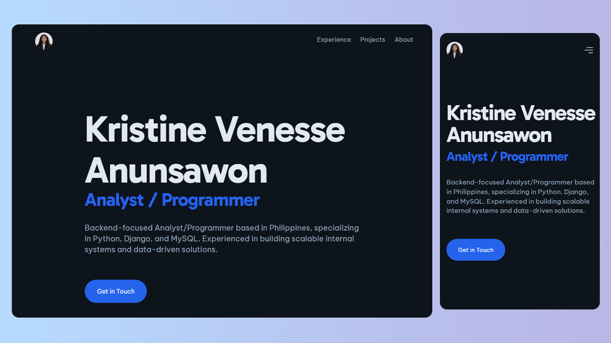

# Personal Portfolio Website

Welcome to my personal portfolio website!  
This site showcases my projects, skills, and experience as an Analyst / Programmer.
**Live Demo:** https://krissszz-portfolio.vercel.app



## 🚀 About the Project

This portfolio was built to highlight my work, share my background, and make it easy to connect with me.

It includes:
- A collection of my featured projects
- Information about my skills and tech stack
- Contact details for collaboration or opportunities

## 🛠️ Tech Stack

- **Framework:** Astro
- **Styling:** Tailwind CSS
- **Deployment:** Vercel
- **Other Tools:** [TypeScript]

## ⚙️ Getting Started

If you want to run this project locally:

```scheme
# Clone the repository
git clone https://github.com/krissszzz//krissszz-portfolio.git

# Navigate into the project
cd your-repo-name

# Install dependencies
npm install

# Start the development server
npm run dev
```
